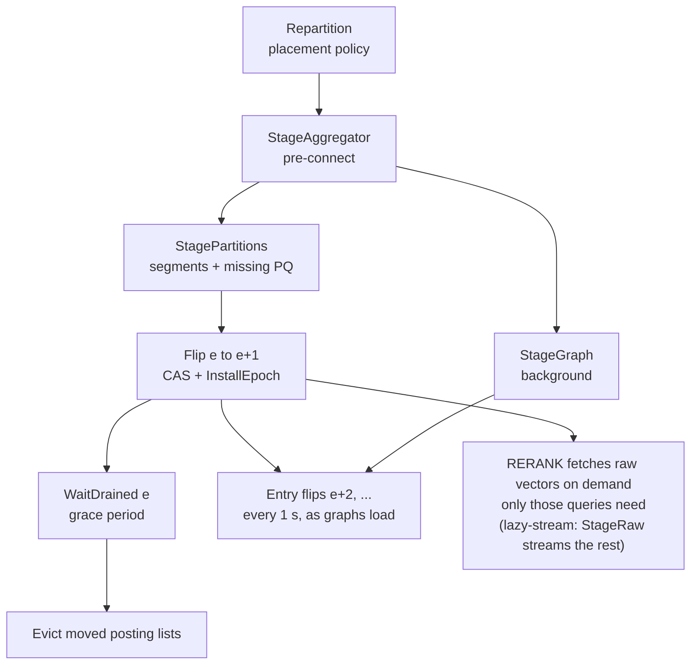

> Snapshot of the rtier design doc kept on claude.ai (in Chinese): exported at rev 123 on 2026-09-27,
> then brought up to date in this file for the lazy raw-vector fetch (overview, control plane, data
> plane, raw vectors, memory table, U1/U8/U9, tests, experiment matrix, next steps). The claude.ai doc
> itself still reads as rev 123. Not synced: the code, `README.md` and `internal/design/design.go` are
> authoritative.

# rtier 模块骨架说明

Sep 24, 2026 · @Chenxu

## 概览

rtier 是区域层（regional tier）非中断重配原型的代码骨架。Go 控制面复用 Koala 的代码，C++ 数据节点把我们已有的 FusionANNS 实现包装成服务，两者通过本地 socket 通信。项目名 rtier 和 Go module 路径都是临时名字，可以随时换。

代码分成三类：

- **已实现**：讨论中已经定下的机制，以及可以直接复用的 Koala 代码。机制包括 epoch 表、原子切换加 grace period、按角色分阶段 ready、独立的批量传输通道加令牌桶、单机网络仿真，固定 n 全局 top-n 需要的检索原语，节点级的 PQ 码存储（每个向量在每个节点只存一份，迁移时只拉缺的，这是 U1 中已定的部分），以及节点级的原始向量存储（按全局规范偏移寻址的本地稀疏文件；迁移后的向量只在查询第一次用到时按需拉取，不再后台补齐，这是 U1 和 U9 中已定的部分）。
- **占位符**：还没讨论完的设计决策。代码里统一标成 `TODO(design)`，走到这些地方时返回 `ErrUndecided`，不替你做选择；少数还没有代码路径的问题只在登记表里记录。
- **测试替身**：为了让协议流程能端到端跑通，测试里放了最简单的 fake，比如按区间切分 partition。它们只出现在测试代码和 `scripts/testing/` 里，不代表设计选择。

## 目录结构

仓库分成三块：Go 控制面和查询聚合、C++ 数据节点（在 FusionANNS 实现上扩展）、实验脚本。Go 部分只用标准库，没有第三方依赖。

| 路径 | 内容 |
| --- | --- |
| `cmd/rtier-controller` | 全局控制面（Koala 的 coordinator） |
| `cmd/rtier-agent` | 每个节点一个的 Go agent，紧挨着 C++ 数据节点 |
| `cmd/rtier-client` | 触发扩缩容、查看状态、列出占位符、单节点基线查询 |
| `cmd/rtier-loadgen` | open-loop 压测，延迟从计划发送时刻算起 |
| `internal/ctrl`, `internal/protocol` | 控制面 RPC 和消息定义 |
| `internal/placement` | partition→node 表、均匀放置策略、迁移计划 |
| `internal/epoch` | epoch 表、原子切换的 store、在途查询计数 |
| `internal/transfer` | 独立的批量传输连接和令牌桶 |
| `internal/query` | 每查询聚合、确定性合并、查询端口协议 |
| `internal/agent`, `internal/controller` | 两个进程的主体逻辑 |
| `internal/frame`, `internal/nodeclient` | 帧格式、C++ 数据节点的 Go 客户端 |
| `internal/metrics`, `internal/config`, `internal/partitioning`, `internal/vecio`, `internal/syncflag` | 指标、配置、partition 清单、向量文件读写、同步原语 |
| `internal/design` | 所有占位符的登记表（U1–U17，没有 U4） |
| `engine/` | FusionANNS 实现，加上 `NodeEngine`、partition 文件（posting 带原始向量的 location）、节点级的 PQ 码和原始向量存储、`rtier_node` 服务和 `rtier_segment` 工具 |
| `test/e2e` | 真实 C++ 进程加进程内控制面，边压测边扩缩容 |
| `scripts/` | 单机实验脚本、网络仿真、指标导入 SQLite |

一个节点 = 一个 `rtier_node`（C++，持有数据、执行检索）+ 一个 `rtier-agent`（Go，负责控制、入口和聚合）。

## 与 Koala / FusionANNS 的对应

Koala 的控制面、放置和实验框架基本按原结构移植，dataflow 相关的部分全部去掉。每个移植文件的包注释里写了出处，`NOTICE` 里有完整清单。

| Koala | rtier | 主要改动 |
| --- | --- | --- |
| `coordinator/{workerManager,managedWorker,controlService}.go` | `internal/controller` | gRPC 双向流换成帧加 JSON 的 RPC；字符串 ACK 换成 request id；`log.Fatalf` 换成返回错误 |
| `worker/{worker,controlPlane}.go` | `internal/agent` | 去掉算子；一个节点有三个角色，按角色分阶段 ready |
| `apiService.go` 的 `rescaleLazy` 七步 | `internal/controller/reconfig.go` | 改成先拷贝、再切 epoch（下一节） |
| `keyby/partitionTable.go`、`evenPartitionPolicy.go` | `internal/placement` | bucket 换成 partition；多出来的一个分给当前持有最多的节点（Koala 在这种情况下会直接退出）；节点数不变时什么也不做 |
| `GenerateMigrationPlan`、`BucketOwnerHistory` | `placement.MakePlan`、`placement.History` | 基本照搬 |
| `stateCommTcpUtil.go` 的帧格式 | `internal/frame`、`engine/node/wire.h` | 加上 req\_id、epoch、status，改成小端 |
| `StateChunkSender` | `internal/transfer` | 独立连接、令牌桶限速、CRC-32 校验 |
| InflightBarrier / DrainBarrier | `epoch.Tracker` | 数据通道里的 barrier 换成按 epoch 的在途查询计数 |
| `metric/*`、`metricCollectorService.go` | `internal/metrics` | 平均值换成 histogram（p99、p99.9）；写 JSONL，脚本转成 Koala 的 SQLite 表 |
| `internal/syncflag` | `internal/syncflag` | 原样复制，加了 `WaitContext` |
| `scripts/runExperiment.py` | `scripts/run_local.py` | 去掉 Kafka 和 SSH，保留按时间触发重配 |
| stop-and-restart | 协议 `stop-and-copy` | 作为 baseline |

FusionANNS 这边，`engine/` 就是之前的实现，加了四样东西：按 partition 存放的 posting list 文件（每个 posting 带向量在页文件里的 location）、`NodeEngine`（运行中加载和淘汰 partition，导航图可以启动后再加载，PQ 码和原始向量都按节点存）、`rtier_node` 服务、`rtier_segment` 工具。原引擎有两处行为改动，都是为了让跨节点的结果确定：

- `HeuristicRerank` 按 (距离, id) 保留前 k 个。原来与第 k 名同距离的候选会被丢掉，结果取决于候选到达的顺序。
- GPU filter 排序一个 64 位键（距离的位模式左移 32 位再拼上 id），平局按 id 决定，和 CPU 后端一致。这部分只编译过，没在 GPU 上跑过，要先跑 `fusion_selftest`。

Go 部分没有用 gRPC。原因是这次的构建环境访问不到 Go 模块代理，没法下载第三方模块；换成标准库也顺带省掉了 protoc 和 cgo。消息定义都集中在 `internal/protocol`，以后要换回 gRPC，只需要替换 `internal/ctrl`。

## 控制面与重配协议

重配分四步：先拷贝数据，再原子切换 epoch，等所有用旧 epoch 路由的查询结束，最后回收旧副本。切换前只拷新节点做过滤必需的东西：posting list 和它缺的 PQ 码。原始向量不随重配搬（默认协议 `lazy`，U9）：切换之后，RERANK 第一次用到哪个本地没有的向量，就由数据节点直接向旧 owner 拉取，只拉用到的；没被用到的一直留在旧 owner 那里。lazy 的前提就是查询只碰迁走数据里的一小部分工作集。对照组 `lazy-stream` 另外让 agent 在切换后按批补齐其余的向量，和 grace period、回收并行。新节点的 entry 角色也不等第二次切换：谁的导航图先加载好，谁就在下一次 entry 切换里成为 entry（每 1 s 合并一次，同样并行）。

| 角色 | ready 的条件 | 对应命令 |
| --- | --- | --- |
| aggregator | 连上下一个 epoch 的所有数据节点 | `StageAggregator` |
| data | 分到的 partition 拷完、缺的 PQ 码从原 owner 拉完，再加载进 `rtier_node`（原始向量不是前提，查询用到时再拉） | `StagePartitions`；lazy-stream 切换后另有 `StageRaw` |
| entry | 导航图拷完并加载 | `StageGraph` |



图是 `internal/controller/reconfig.go` 里 `copyThenFlip` 的执行顺序；导航图很大，所以在后台和数据拷贝并行传。每个新节点的图加载完就单独汇报；数据切换之后，controller 每隔 `entry_flip_interval`（默认 1 s）把就绪的新节点合并成一次 entry 切换（`promoteEntries`），不等最慢的图，也不等 grace period。某个节点的图没加载成功，它仍是 owner 和聚合器，其他节点照常成为 entry，rescale 返回的错误里会点名。重配要等所有拉图都结束才返回，所以不会和下一次重配重叠；lazy 下原始向量不在其中，查询在重配返回之后仍会继续按需拉取。旧 owner 能一直当来源，靠三条不变量：节点从不删除自己持有过的原始向量，离开的总是最后加入的节点，缩容时分区回到持有过它的节点（U3）。以后如果有磁盘预算或别的离开顺序，就要先把只有离开节点才有的向量交接出去。`lazy-stream`、`copy-then-flip` 和 `stop-and-copy` 保留为对照组：第一个在切换后把其余向量流完（重配等它结束，离开的节点在此之前保持在线），后两个在切换前（后者在暂停期间）就把原始向量拷完，切换后不再按需拉取。

查询在重配期间保持正确，靠的是两点：

- 每个查询在 entry 上固定当前的 epoch 表（`Tracker.Enter`），路由、选聚合器和聚合都按这张表，pin 一直持续到结果返回，转发出去的聚合也算在内。转发请求带着这个 epoch 和按 owner 分好的 list，聚合器照做，不看自己装了哪个 epoch。所以刚加入、还没装上新 epoch 的节点，和已经越过旧 epoch 的离开节点，都能照常聚合（`test/e2e/flip_race_test.go` 复现了这两种竞争）。
- 从切换前到旧 epoch 的查询全部结束，新旧 owner 同时持有数据，所以按哪张表路由都能找到 partition。新 owner 缺的原始向量由它自己在精排前向旧 owner 拉取；旧 owner 回收之后也保留这些向量（和 PQ 码一样当缓存），所以整个预热期都有来源。数据不可变，不需要 Koala 的 fast-forward。

其他约束：同一时刻只允许一次重配（沿用 Koala 的 CAS 保护）；扩容从已注册的空闲节点里挑，缩容移除 ID 最大的节点；一次重配不能同时加减节点。`stop-and-copy` baseline 在拷贝前暂停所有 entry 的接入并等在途查询清零，切换后再恢复。

什么该进 epoch 表：判据是它是不是只在节点集合变化时才变。归属和聚合器候选集是这样，搭 flip 的顺风车不花额外代价；而 entry 可用性还会因为「graph 传完了」这种本地事件而变，于是每批就绪的新节点都要多一次 flip（每 1 s 合并一次），重配也要等所有 graph 传完才返回。需要 epoch 一致的是决定「数据在哪、该等谁排空」的字段；查询投错节点只值一次 UNAVAILABLE 加重试（U17）。

失败时的处理：切换前出错，已经拷到目标节点的 partition 会被删掉，为它们装入的 PQ 码也会释放（agent 先停掉还在跑的 staging 再清理），旧 epoch 继续有效；切换后出错，协议停下并保留所有旧副本（安全，但浪费空间）；要不要重试或回滚是 U13。stop-and-copy 无论成败都会恢复所有被暂停的节点。重配不跟调用方的连接绑定，客户端断开也会跑完。

端到端测试（`test/e2e`，8000 条合成向量、2 核虚拟机，节点数 2→3→2→3，共 6 个 epoch）验证的是正确性，不是性能。每个查询的结果都和单节点答案逐条比对，每次扩缩容后还核对拉取的 PQ 码数、各节点持有的 PQ 码数，以及原始向量：每个节点新增的向量恰好装入一次（后台流装入的加上按需拉取的，等于新增的向量数）。后加入的节点跑在去掉了页文件的索引上，只能从其他节点拿原始向量：

| 协议 | 查询数 | 与单节点答案不一致 | 因 unavailable 重试 | 最大延迟 |
| --- | --- | --- | --- | --- |
| lazy | 5836 | 0 | 0 | 13.8 ms |
| copy-then-flip | 6296 | 0 | 0 | 10.4 ms |
| stop-and-copy | 5792 | 0 | 72 | 37.0 ms |

当时 lazy 还带后台流（现在的 `lazy-stream`）：第一次扩容（2→3）新节点要 3977 个向量，3935 个由后台流补齐，42 个被查询按需拉取；缩回和再次扩出都是 0 个，分区回到了持有过它们的节点。现在的 lazy 在同样的测试里只按需拉取几百个（例如 4223 个中的 340 个），其余不搬。

## 数据面与 C++ 节点服务

所有连接都用同一种帧格式。C++ 数据节点提供下表这些操作，Go 聚合器用其中的 FILTER 和 RERANK 拼出一次分布式查询。

帧格式（小端，头部 28 字节）：`"RTF1" | length | type | flags | status | req_id | epoch | body | "FEND"`。Go 端在 `internal/frame`，C++ 端在 `engine/node/wire.h`。

| 操作 | 请求 | 返回 | 用途 |
| --- | --- | --- | --- |
| PING / INFO | 无 | 无 / JSON | 健康检查；驻留的 partition、PQ 码统计、每个操作的计数 |
| LOAD\_GRAPH | 路径 | 无 | entry 角色 |
| LOAD\_PARTITION / EVICT\_PARTITION | partition、PQ 来源、原始向量来源（旧 owner 的数据节点）、路径 | 无 / 是否驻留 | data 角色、回收 |
| PQ\_MISSING | 按来源分组的 segment 路径 | 每组缺的向量 id | 迁移前列出要拉的 PQ 码 |
| PQ\_GET / PQ\_PUT | id 列表 / id 和 PQ 码 | PQ 码 / 装入数 | 原 owner 读出、目标节点装入 |
| PQ\_RELEASE | 无 | 释放数 | 清理没被引用的 PQ 码 |
| RAW\_MISSING / RAW\_CHECK | 按来源分组的 segment 路径 / location 列表 | 每组缺的 location 及各自所在的一个 list / 其中仍缺的 | 流式传输（对照组）列出要流入的原始向量；每批之前再查一次 |
| RAW\_GET / RAW\_PUT | location 及各自所在的 list / location 和向量 | 向量 / 装入数 | 旧 owner 读出（自己也缺的，按那个 list 的来源先去上游拉）、目标节点装入；按需拉取也走 RAW\_GET，数据节点之间直连 |
| NAVIGATE | nprobe、ef、查询向量 | list ID，近的在前 | entry 的第一步 |
| FILTER | top-n、list ID、查询 | (id, PQ 距离)，按 (距离, id) 排序 | 数据节点上做 PQ 过滤 |
| RERANK | k、id 列表、查询 | (id, 精确距离) | 读本地页精排，缺的原始向量先向旧 owner 拉；固定 n，不提前停止 |
| SEARCH\_LOCAL | k、nprobe、n、ef、heuristic | top-k | 单节点 baseline 和正确性基准 |

一次查询的路径：

1. 客户端把 QUERY 发到某个 entry 的查询端口。
2. entry 在本地 `rtier_node` 上 NAVIGATE，得到 nprobe 个 list。
3. entry 用自己固定的 epoch 算出这些 list 的 owner，也就是查询要转发到的节点，再在其中选聚合器（默认 selector `owner`）：自己是 owner 就自己聚合；只有一个 owner 时转发给它，两个阶段都在数据所在的节点上做；否则还是自己聚合。
4. 聚合器照 entry 固定的 epoch 和 entry 算好的分组执行（转发时两者随请求带上，聚合器自己不 pin epoch，也不重新分组），由 strategy（U5）向各 owner 发 FILTER / RERANK。
5. `MergeTopK` 按 id 去重、按 (距离, id) 排序，返回向量 ID。映射到 RAG chunk ID 是 U12。

每个节点有三个端口：`rtier_node` 的数据端口（其他节点的聚合器直连）、agent 的查询端口、agent 的批量传输端口。批量传输走自己的连接，发送方用令牌桶限速，收端校验 CRC-32。`rtier_node` 每个连接一个线程、同一时刻只处理一个请求，Go 客户端靠连接池并发。

几个状态码值得注意：NOT\_RESIDENT（查询中遇到就报 U7）、NO\_GRAPH、UNDECIDED（碰到占位符）、PQ\_ABSENT（节点缺某个 PQ 码，agent 会重新列出缺的码再拉）、PQ\_FULL（超出节点的 PQ 预算）、RAW\_ABSENT（节点缺某个原始向量，也拉不到）；查询端口还有 UNAVAILABLE，表示该节点暂停接入或已不是 entry，客户端换一个 entry 重试。

## PQ 码：节点级存储与去重迁移（U1 已定部分）

每个数据节点对每个向量只存一份 PQ 码，不管它出现在本节点多少个 posting list、多少个 partition 里；扩缩容时，目标节点只从原 owner 拉自己还没有的码，拿全之后才上线；分区迁走后，旧节点把它的码留作缓存。raw vector 和 chunk 在新节点上线之后再取（U9）。

- **存储**：`PQStore`（`engine/include/fusion/pq_store.h`）按槽位存码，槽位数就是节点的 PQ 预算（`rtier_node --pq-capacity`，即 HBM 预算）。每个码处在三种状态之一：被驻留的 partition 引用（live）、为进行中的 staging 保留（staged）、分区迁走后留下的缓存（cached）。数据集是静态的，缓存的码一直有效；只有之后某次 staging 放不下时才按槽位顺序挤掉缓存的码，live 和 staged 的永远不动。引用的释放由后台线程做，不占查询路径。
- **迁移**：segment 到齐后，节点按来源分组列出缺的码（`PQ_MISSING`，去掉本地已有的，并保证一个码只从一个来源拉；本地已有、这次要用的码同时被保护起来）；各原 owner 通过限速的 bulk 通道只发这些码（`PULL_PQ`）；装入（`PQ_PUT`）后才 `LOAD_PARTITION`。所有目标节点都装完之后才 flip，新节点一上线就能做 PQ 过滤。初次部署从索引文件读。
- **过滤**：CPU 和 GPU 后端都按槽位取码，结果仍按 (距离, id) 排序，和按 id 取码时逐条一致。GPU 端用 pinned 暂存加 scatter kernel 写入新码，写完同步。
- **失败**：staging 失败时 agent 释放为它装入的码，被它保护的缓存码回到缓存；controller 回滚时，agent 先停掉还在跑的 staging 再清理。

端到端测试里（8000 条向量、8 个 partition），每次重配拉取的 PQ 码数都和“目标节点从没持有过的码”逐一核对。最后一次扩容里，重新加入的节点还留着上次的码，所以拉得很少：

| 重配 | 拉取的 PQ 码 | 每个 partition 各带一份时 |
| --- | --- | --- |
| 2→3 | 4169 | 5077 |
| 3→2 | 2344 | 5077 |
| 2→3（再次） | 1137 | 7130 |

去重只消掉节点内的重复，节点之间的重复还在，而且取决于 list 怎么分组。在 20 万条合成向量上：按 list ID 区间切成 16 个 partition（测试用的分法），2 个节点时每个节点要存 87–88% 的码，扩到 3 个节点后仍有 77–78%；按空间连续划分（64 个 partition 放 4 个节点）时每个节点约 40%，仍高于均分的 25%。U2 和 U3 要把这部分算进去。

保留旧码要和放置配合才有收益。同样是 20 万条合成向量、64 个空间分区，先从 4 个节点扩到 5 个再缩回 4 个，缩容那一步要拉的 PQ：

| 缩容时的做法 | 要拉的 PQ（占全部向量） |
| --- | --- |
| even 策略，不保留旧码 | 32.6% |
| even 策略，保留旧码 | 29.5% |
| 还给原主人，不保留旧码 | 18.3% |
| 还给原主人，保留旧码 | 0% |

even 策略缩容时按轮转分配，分区多半回不到原主人。“优先还给原主人”记在 U3 里，骨架里的 `placement.History` 已经记录了谁持有过哪个分区。

在现在的放置规则下，缓存其实永远不会被挤掉：扩容只从节点手里拿走分区，可逆缩容只把拿走的还回去，所以一个节点的 resident 集合恒等于它在初始规模时持有的那批向量——而那本来就装得下，否则初始部署就起不来。所以 `--pq-capacity` 是按最小集群规模定维的，不是按当前规模；e2e 现在直接断言 evicted = 0。

不变量依赖三个前提：不缩到初始规模以下、离开的就是当初加入的那些节点、放置不会把分区交给从没持有过它的节点（热度感知放置就会，U3 的开放部分）。把挤掉的码落盘（按分区写成连续文件，之后本地读代替网络拉）可以放宽前两条，代价是和 rerank 抢同一块盘；暂不实现，只作为备选记在这里。

上面这些开销有同一个根因：posting list 之间有重叠。一个向量会进 r 个 list（FusionANNS 默认切分下实测 r ≈ 7.3），所以两个分区的向量集合不是不交的；一个节点拿到一批分区之后，必须在节点级判断「这个向量的码我是不是已经有了、放在第几个槽」，否则同一个向量的码会被存七遍。槽位寻址就是这笔去重的记账，而它需要一张 ID → 槽的表，定义域是全库向量数而不是本节点持有的向量数。r 是可调的：r = 1（每个向量只进最近的一个 list）会让跨分区重复、节点内去重、槽位表一起消失，代价是召回率——这正是 U2 要量的东西。

已知限制（详见 `engine/README.md`）：`PQ_MISSING` 的回复要放进一帧（约 6700 万个 id），十亿级时需要分批；GPU 模式下每个码存两份——显存里那份供 ADC kernel 读，主机内存里那份（容量 × m 字节）供 PQ\_GET 和记账，要不要保留是 U15。

扩容的动因是单节点的服务容量（吞吐和尾延迟），不是存不下。HBM 放不下一份完整的 PQ 码副本，才使得每个节点只保留自己持有 ownership 的那部分码，迁移因此不可避免——这是两个不同的问题。具体的目标点（向量数 n、每码字节 m、卡的显存）待定。

## 原始向量：规范偏移与稀疏页文件

原始向量按**全局规范偏移**寻址，每个节点只持有这个地址空间的一个稀疏子集。偏移因此对迁移免疫：posting list 从原 owner 继承过来，里面的位置永远有效，节点上不需要任何全局的 vector → page 映射。

迁移的最小单位是**单个向量**而不是页：bucket layout 会把多个 bucket 的尾部 bin-pack 进同一个 4 KB 页，按页传会把别的 partition 的向量一起搬走；写入时把同一页里相邻的向量合成一次写，由 page cache 拼成整页再落盘。节点内去重是地址自带的：同一个向量不管被多少个 list 点到，规范偏移只有一个。页的回收要等节点不再拥有页内任何向量（punch hole），而按可逆放置那条不变量，这条路径正常走不到，也没有实现。

location 放进 posting 条目（vector ID 4 B + 页号和槽位打包成的 u32 4 B，合 8 B/条目），不另留全局 map。按每节点算：posting 的量是 n·r/N，而 map 是 n，所以只要节点数 N 大于副本数 r（约 7.3），放进 posting 反而更省，且随 N 继续拉开。更重要的是可用性：map 会成为第三份全局副本，而且卡在 rerank 关键路径上——没有它就不知道去哪儿取向量，和导航图是同一个陷阱。

这套寻址让 U9 的懒取几乎不需要额外设计：稀疏文件上「这个向量在不在」是纯本地判断（每个 location 一位），miss 就按规范偏移去对端取。代价有两处：共享尾页在节点上可能只用到几个槽，SSD 空间有放大；U14 一旦允许更新，layout 变了偏移就变，页和 posting 里的位置都要带版本。

现状（已实现）：`rtier_segment --layout` 把每个 posting 的 location 写进 segment（第 2 版，payload `lists+locations`，旧目录会被拒绝）；数据节点把自己持有的向量放在本地稀疏文件里（`rtier_node --raw-file`），版式和整份页文件相同，每个 location 一位 presence；候选向量的 location 从 PQ store 查，分区加载时随码记下，节点上没有 `layout_*.map`。索引的页文件只在初始部署时读；端到端测试里后加入的节点都跑在去掉了页文件的索引上。写入走 page cache，精排用 O_DIRECT 读整页，内核在直读之前会把覆盖到的脏页先写回，所以读到的一定是已经置位的向量。

## 每节点的内存账

分区的理由是单节点容量，所以「一个节点要装下什么」值得单独算一笔。下表按 10 亿向量、N = 8 个节点、m = 16 字节码、128 维估；最后一列是扩容能不能把它摊薄——摊不薄的那几行才是真正限制单节点规模的东西。resident 指本节点持有的分区命名到的去重后向量数，这里取 4 亿（40%），它完全由 U2 怎么分组决定：随机分组约 62%，把重叠的 list 分到一起可以低得多。

| 结构 | 每节点 | 随 N 摊薄 | 依据 |
| --- | --- | --- | --- |
| 导航图（list head 的 HNSW，DRAM） | 32–71 GB | 否，全局副本 | 实测 308 B/head、head 占向量数 10.3%，约 70 MB / 百万向量（U16） |
| PQ 码 · GPU 侧 | 6.4 GB | 是 | 4 亿 resident × 16 B |
| PQ 码 · host 影子 | 6.4 GB；m = 128 时 51 GB | 是 | 同样大小的第二份，供 PQ\_GET 和记账（U15） |
| posting list（只有向量 ID） | 3.65 GB | 是 | 7.3 × 10⁹ 条 ÷ 8 × 4 B |
| posting list（加 raw vector location） | 7.3 GB | 是 | 上一行 + 每条 4 B 的 (page, slot) |
| `PQStore::slot_of_` | 4 GB | 否，按全库向量数 | 稠密 int32 数组，10⁹ × 4 B |
| 槽位记账（resident 向量的 ID、引用计数、location） | 5.2 GB | 是 | 4 亿 × 约 13 B |
| 原始向量的 presence 位图 | 125 MB | 否，按全库 location 数 | 每个 location 一位 |

优先级是量级决定的：导航图的 32–71 GB 比其他所有行加起来还大，而且是唯一一条扩容摊不薄的大项，所以 U16（更小的 head 表示、更低的 head 比例、或者只复制 HNSW 上层而把 level 0 分区）排第一；其次是 host 影子，m = 128 时它一条就 51 GB，U15 要回答的是能不能只留 GPU 一份、迷移时走 D2H 读回；`slot_of_` 的 4 GB 排第三。这张表也说明了为什么 raw vector 的 location（第五行多出的 3.65 GB）是划算的：它换掉的是一份每个节点都要复制、并且会拖慢新节点上线的全局 map，且这 3.65 GB 会随 N 变小。

`slot_of_` 是我们自己违反「不要有按全库规模定大小的每节点结构」这条原则的地方：它按定义域而不是按 residency 定大小。暂时不改。它只出现在装入和迷移路径上（`PQ_MISSING` 算差集、`PQ_PUT` 落槽），查询路径上不碰它，所以不影响延迟；在现在的实验规模上也不是问题（100 万向量 4 MB、1 亿 400 MB，10 亿 才 4 GB）。

改法本身是清楚的：把稠密 int32 数组换成按向量 ID 排序的 (ID, slot) 数组，单次查询二分，算 `PQ_MISSING` 的差集用归并——差集本来就是两个有序集合的运算，归并比逐个查还快。成本是 8 B / resident 向量，和 4 GB 的交叉点在 residency 50%：按上表的 40% 只省 0.8 GB，U2 把重叠的 list 分到一起做到 20% 能省 2.4 GB，而随机分组（62%）反而多吃 1 GB。所以这件事的收益取决于 U2，应该等 U2 定下来、或者数据集到 1 亿以上再动。改动限在 `engine/include/fusion/pq_store.h` 和 `pq_store.cpp`：`slot_of_` 是私有成员，对外只有「在不在」和「在第几槽」两个入口。分页的两级数组考虑过，不行：向量 ID 和分区不相关，一个节点持有的向量几乎均匀散在整个 ID 空间里，每一页都会被碰到，省不下来。

## 占位符清单

16 个待定问题登记在 `internal/design/design.go`。代码走到这些地方会报 `design decision pending [Un …]`，不会默默替你选一个答案；U12、U14、U15、U17 暂时还没有对应的代码路径，登记表里写明了目前的行为。`bin/rtier-client design` 可以列出全部。编号里没有 U4：热点 partition 的副本不在本项目范围内，热 key 的弹性读容量是流式系统那套 serverless 实例的解法，rtier 坚持每个 partition 单 owner；编号留空以免其他 ID 移位。

| ID | 待定问题 | 讨论过的选项 | 代码位置 | 现在的行为 |
| --- | --- | --- | --- | --- |
| U1 | chunk 放哪（PQ 码与原始向量已定） | 已定两件事：（1）PQ 码按节点存，每个向量每个节点一份，迁移只拉缺的；分区迁走后旧节点把码留作缓存。（2）原始向量按全局规范偏移寻址，location 放进 posting entry（ID 4 B + location 4 B）跟着 list 一起从旧 owner 继承，每个节点只持有这个地址空间的稀疏子集（本地稀疏文件，每个 location 一位），迁移最小单位是单个向量，节点上不需要任何全局 vector → page 映射；旧 owner 保留迁走分区的向量作为缓存。向量怎么到新节点见 U9。待定：共享尾页带来的空间放大；原始向量的磁盘预算与淘汰（现在一个节点保留它持有过的所有向量）；U14 的版本化；chunk 放哪（和 U12 一起定） | `engine/include/fusion/raw_store.h`、`partition.h`、`internal/partitioning/payload.go` | PQ 码与原始向量的节点级存储、去重迁移、迁走后保留都已实现；索引的页文件只在初始部署时读 |
| U2 | list→partition 怎么分、分几个 | 目标是把 r(P) 降下来：r(P) = Σ\|分区的向量集合\| / \|并集\|，也就是跨分区的重复度（不分区时为 1，随机分组趋近 list 层面的 r ≈ 7.3）。它同时决定 PQ 码的冗余、每节点 residency、以及 `slot_of_` 值不值得改（见「每节点的内存账」）。候选：按导航图局部性分组、centroid k-means、哈希（基线）；分几个 partition 由每个 partition 的字节数和扇出定。要在真实数据集上同时量 r(P)、recall 和每节点 residency | `internal/partitioning/partitioner.go`、`engine/tools/rtier_segment.cpp` | `rtier_segment` 只接受现成的分配文件；测试用按区间切分的 fake |
| U3 | 放置目标（可逆性已定） | 已定：缩容时把分区还给持有过它的节点，扩缩容往返精确还原，缓存的码让缩容不搬任何 PQ（Koala 的 even 不可逆：4→8→4 后搬过的 32 个分区一个没回家）。待定：按各层字节和访问热度加权（热度重平衡和严格可逆互相拉扯）；节点级 PQ 下哪些分区放在一起决定了重复的码有多少，staging 还要满足每个节点的 PQ 预算；扩容时新节点是从单一 donor 接连续块，还是按 Koala 的规则从所有 donor 轮流拿（来源并行度更高）；节点数不变时的 rebalance；缩容移除哪些节点、扩容加入哪些（缓存不变量要求回来的就是当初离开的那个） | `internal/placement/weighted.go`、`internal/controller/reconfig.go` | 默认 even-reversible：缩容把分区还给原主人，往返 100% 还原（单测），e2e 断言缩容拉取 0 个码；even 保留为 Koala 基线；weighted 报 undecided |
| U5 | 固定 n 下的全局 top-n | 两阶段已实现：每个 owner 返回自己的 top-n，聚合器合并出全局 top-n，再回到报告它的 owner 精排，和单机答案严格一致，代价是第二次往返。待定：值不值得这次往返，还是给每个 owner n × 份额的配额、一次往返（答案可能与全局 top-n 不同） | `internal/query/query.go` | two-phase 可用，e2e 用它逐条核对单机答案；proportional-quota 报 undecided，没配置策略时查询报错 |
| U6 | 聚合器外包 | 已定适用范围：只有扩容中新节点的 graph 还在传的那个窗口里，能聚合的节点才多于能接客户端查询的节点；warmup 策略把扇出和合并交给它们。待定：值不值得——聚合器自己的活只是扇出和合并，贵的 navigate 留在 entry，而那正是没 graph 做不了的（CPU 上实测：445 µs 服务端查询里 navigate 占 160 µs）；以及按负载选聚合器的策略。外包聚合和让新节点接查询并转发 navigate（U16 的 stream）分工完全一样，只是发起方向相反 已定（常态）：entry 先 NAVIGATE，算出查询要碰到的 owner，再在其中选聚合器（selector `owner`，默认）。自己是 owner 就自己聚合；单一 owner 时转发给它，少一次网络往返，PQ 候选也不出节点；其余情况自己聚合，因为转发只是多一跳换掉并行子查询中的一个，还会把聚合压到热分区的 owner 上。局部性分组下，2 / 8 / 16 个节点时 entry 是 owner 的查询占 90% / 62% / 47%，单一 owner 占 20% / 5% / 5%（`rtier-overhead -owners`）。 | `internal/query/selector.go`、`internal/agent/serve.go` | 默认 owner：按 owner 集合选聚合器，e2e 核对转发次数和答案；warmup 已实现（只在 graph 窗口外包）；local 是基线；按负载的 outsource 报 undecided |
| U7 | 带着过期 epoch 的子查询 | 数据还在就本地服务、转发给新 owner、或拒绝让聚合器重试 | `internal/query/query.go`（`Aggregator.Run`） | 按协议不会发生；真发生时报 undecided |
| U8 | 后台传输限速如何自适应 | 独立连接加令牌桶（已实现，固定速率），发送端分两个优先级（已实现）：data 是 segment 和 PQ 码，节点拥有分区所需；background 是导航图和 lazy-stream 切换后的原始向量流（U9），只拿没有 data 发送方在等的令牌。待定：怎样跟前台延迟联动；lazy-stream 下图（entry 角色要）和原始向量流同在 background 里平分，要不要一方优先或按权重分享 | `internal/transfer/adapter.go`、`tokenbucket.go` | 固定速率；图和原始向量流默认走 background（`graph_priority`、`raw_priority`）；选 adaptive 启动即报错 |
| U9 | 新节点上线后懒取原始向量（和 chunk） | 已定：新节点拿全 posting list 和 PQ 才上线，上线即可过滤；原始向量只在查询第一次用到时才搬（协议 `lazy`，默认），lazy 的前提是查询只碰迁走数据里的一小部分工作集。RERANK 遇到本地没有的向量，由数据节点直接向该分区的旧 owner 拉取（RAW\_GET，精排等它回来）。来源按 posting list 记（该 list 所在分区的旧 owner；list 互相重叠，不需要按向量的表）：RERANK 请求带上这次查询在该 owner 上的 list，RAW\_GET 给每个向量带上它所在的 list，被问到自己也缺的向量时按那个 list 的来源先去上游拉（连续迁移也成立）。重配不等原始向量。旧 owner 一直是有效来源，因为节点从不删除持有过的原始向量（静态数据集）、离开的是最后加入的节点、缩容时分区回到持有过它的节点（U3）；有了磁盘预算或别的离开顺序，就要先交接只有离开节点才有的向量。对照组：`lazy-stream` 切换后另外把其余向量流完（StageRaw，`raw_priority`；RAW\_MISSING 让每个缺的向量只列一次并带一个 list，每批之前 RAW\_CHECK 去掉查询已经拉到的；重配等它结束），也是以后节点下线、故障后补副本的基础；copy-then-flip 在切换前拷完，stop-and-copy 在暂停期间拷完。待定：把拉取移出查询路径（缺的候选改由旧 owner 精排，再在后台只拉用到的）；合并并发的按需拉取；决定工作集大小的负载模型（U11）；chunk（U12） | `internal/controller/reconfig.go`（copyThenFlip、stageRaw）、`internal/agent/control.go`（StageRaw）、`engine/src/node_engine.cpp`（EnsureRawInLists、FetchRaw、SetListSources）、`engine/node/server.cpp`（PeerPool） | 已实现；e2e 断言 lazy 只拉用到的、每个最多一次、答案精确（含一例无负载扩容不搬任何原始向量、经中间节点的链式拉取、重复查询不再拉取），对照组断言每个新增向量恰好装入一次 |
| U10 | 原子切换用的 epoch store | etcd 事务（讨论过）vs 单机原型用的 controller 本地 CAS；controller 切换到一半故障怎么办 | `internal/epoch/store.go` | 本地 CAS；选 etcd 报 undecided |
| U11 | 负载模型 | Poisson open-loop（已实现）vs 回放 SemDN 式的突发、任务相关查询流（SCDN 的 experiments/locality/workload.py 已经把这类 trace 的参数测出来了） | `cmd/rtier-loadgen/arrivals.go` | semdn 报 undecided |
| U12 | 向量 ID → RAG chunk ID | chunk 存储和取回路径还没设计 | `internal/query/query.go`（`Result`） | 返回向量 ID；还没有代码路径做映射 |
| U13 | 重配中途出错（节点或 controller） | 重试失败的步骤、回滚、或跳过故障节点继续 | `internal/controller/reconfig.go`（`copyThenFlip`） | 切换前失败则删掉已拷贝的 partition；切换后失败则停下、保留所有旧副本，并报 undecided |
| U14 | 数据集更新 | 现在数据集是静态的，缓存的 PQ 码和页不会过期；有插入、删除或重新编码时，需要版本号、让缓存副本失效，并维护 posting list 和导航图 | `engine/include/fusion/pq_store.h` | 还没有代码路径 |
| U15 | 主机内存里那份 PQ 码副本要不要留 | GPU 模式下每个码存两份：PQStore 在主机内存持有权威副本（容量 × m），filter 在显存里持有 ADC kernel 读的那份，随分区加载由 StoreCodes 填。主机副本让 PQ\_GET 和记账不碰 GPU；去掉它能省下这份 DRAM，但迁移源要 D2H 读回，和自己的查询 kernel 抢 GPU | engine/include/fusion/pq\_store.h、engine/src/node\_engine.cpp、engine/src/gpu\_filter.cu | 两份都在；CPU 后端直接读主机那份，不再复制。还没有代码路径 |
| U16 | 导航图作为全局副本：大小与传输模式 | 每个 entry 都需要整份图，而新节点是白板——不允许在空闲节点上预置（实验里可以预注册节点，但预置 graph 等于把最大一笔传输从账上抹掉）。实测 dim 32 下每个 head 约 308 B、head 占向量数 10.3%，折合百万向量约 70 MB、十亿级几十 GB，比新节点要拉的 PQ 码还大。待定：eager（今天：重配时传整份，每个新节点的图一加载好就在下一次 entry flip 里拿到角色，每 1 s 合并一次）对 stream（立刻给角色，转发 NAVIGATE，后台补齐）；以及怎么把它变小：head 向量按数据集 dtype 存、降低 head 比例、或只复制 HNSW 上层而 level-0 跟着分区切（navigate 变分布式，recall 会变） 已定传输本身：新 entry 的图源在触发重配时按 round-robin 分配给现有 entry（游标跨重配延续），并以 background 优先级拉取。新节点先要能做 FILTER 和 RERANK，这只需要 posting list 和 PQ 码；导航是查询里最小的一份，现有 entry 可以先代劳。所以图只用 segment 和 PQ 传输剩下的带宽，不会拖慢 flip；配合 U6 的 warmup，聚合在图到齐之前就能交给新节点。 | `internal/controller/reconfig.go`（graphSources、StageGraph、第二次 flip）、`internal/transfer/tokenbucket.go`（优先级） | 只有 eager 模式；图源在触发时按 round-robin 分配（rescale 回复里的 `graph_sources`），默认以 background 优先级拉取（`graph_priority`，设成 data 就是对照组） |
| U17 | 客户端可用列表放在哪里 | 现在 entry 集合是 epoch 表的一个字段，所以「graph 传完了」这件纯本地的事要花一次 flip（现在每 1 s 合并一次、和 grace period 并行，不等最慢的图），重配也要等所有 graph 传完才返回。提议：coordinator 在 epoch 之外维护可用列表，graph 齐了才加进去；在那之前新节点只接转发来的活（子查询，以及 U6 的聚合）；缩容则先从列表摘掉、排空、再 flip。判据：只有「只在节点集合变化时才变」的字段才该进 epoch 表（归属和聚合器候选集是，entry 可用性不是），因为需要 epoch 一致的是「数据在哪、该等谁排空」 | internal/epoch/table.go（Table.Entries）、internal/agent/serve.go（entry）、internal/controller/reconfig.go（promoteEntries） | 还没有代码路径；投错节点的查询会得到 UNAVAILABLE 并重试 |

另外有两类不算设计问题、但也没定的东西：`scripts/emulation/netns.sh` 里的链路参数（延迟、带宽）标了 `TODO(experiment)`；GPU 路径的改动还没在真卡上跑过。

## 构建、测试与单机运行

一条命令构建并跑完全部测试。在 2 核虚拟机上，从解压到测试全部通过用了约 40 秒（CPU 版）。

需要 Linux、CMake ≥ 3.18、带 OpenMP 的 C++17 编译器、Go ≥ 1.24（只用标准库）、Python 3（`make_synthetic.py` 需要 numpy）。CUDA ≥ 11 和 liburing 可选。

```sh
make                 # 引擎（CUDA=AUTO）和 bin/rtier-*
make test CUDA=OFF   # C++ 单测 + Go 单测（-race）+ 端到端测试
make e2e             # 只跑端到端测试，带日志
```

测试覆盖：C++ 端 `fusion_tests` 8 项、`rtier_node_tests` 9 项（包括：把 partition 拆到两个节点后结果和单节点完全一致、PQ 存储的引用计数和容量、两节点间的 PQ 迁移、查询并发下驱逐和槽位复用、原始向量存储，以及节点间的原始向量迁移——按需拉取、连续迁移时按 list 来源的转拉、对照组的流式补齐，节点的索引里没有页文件）；Go 端 9 个包的单测，加上 `test/e2e` 的 13 个测试：四种协议下边压测边扩缩容、lazy 只搬查询用到的原始向量（无负载扩容一个都不搬、经中间节点的链式拉取、重复查询不再拉取）、从单节点扩到两节点、PQ 预算不够时 staging 干净地失败、占位符确实会报错、压测中关停数据节点，以及 owner 规则选聚合器、图源 round-robin、新节点按图就绪分批成为 entry、可逆放置扩出再缩回，flip 前后跨 epoch 的两种竞争（新节点比 entry 晚装上新 epoch、离开的节点收尾已接下的查询），以及卡住原始向量流时查询全靠按需拉取、答案仍与单节点一致。把引擎用 `-fsanitize=address,undefined` 编译并让 `RTIER_ENGINE_BIN` 指向它，节点日志里出现 sanitizer 报告时端到端测试会失败；目前是干净的。用 CUDA 编译时，如果 nvcc 不支持系统默认的 gcc，给 cmake 加 `-DCMAKE_CUDA_HOST_COMPILER=g++-12`。

单机跑一次完整实验：

```sh
python3 engine/scripts/make_synthetic.py --n 1000000 --nq 1000 --dim 128 --dtype uint8 --out data/syn
engine/build/fusion_build --base data/syn-base.u8bin --out /tmp/rtier-run/index
# list->partition 分配是 U2；下面是只供测试的占位实现
python3 scripts/testing/make_range_assignment.py /tmp/rtier-run/index 64 data/assign.bin
python3 scripts/run_local.py configs/experiment.synthetic.json results/run1
```

`run_local.py` 按 Koala `runExperiment.py` 的流程走：建索引、切 partition、起 controller 和各节点、压测、按 `Reconfigurations` 里的时间触发扩缩容、收集结果。结果目录里有 `metrics.jsonl`、`metricCollector.db`（Koala 的表结构，可以直接用 Koala 的画图脚本）、`latency.csv`、`reconfigurations.json` 和各进程日志。

查询现在走 two-phase 策略（配置里的 Strategy 设成 two-phase）。在这台两核的沙箱里用 5 万条合成向量跑过一次 1→2：2249 条查询全部成功，recall 0.96；负载在第 10 秒从 40 升到 120 q/s，扩容在第 13 秒触发、用了 8.3 秒（后台限速 300 KB/s），两次 flip 落在 18.9 秒和 21.3 秒，窗口 p99 从 4.0 毫秒升到 5.4 毫秒。那次还是全局副本；lazy 协议下（3 万条、64 维 uint8、300 KB/s 限速）的 1→2 冒烟：切换后约 3.5 秒内按需拉取 8.4K 个向量，流在切换后 4.2 秒补齐其余 19.3K 个；每批约 64 KB，发之前去掉查询拉过的，重复传输约 2%（每批 8192 个向量时是 16%）。

小实验分两步跑：先用 `configs/experiment.small-calibrate.json` 跑容量阶梯，看单节点在哪个速率开始跟不上；再把 Load.Rate 设在它下面、RateSteps 设在它上面，跑 `configs/experiment.small.json`。结果目录里除了指标和 latency.csv，还有 `scripts/plot_run.py` 画的 timeline.svg（吞吐和 p50/p99 的时间曲线，标出 flip 和重配窗口）和 timeline.csv。

网络仿真：在实验配置里设 `"Emulation": {"Netns": true, "Delay": "100us", "Rate": "10gbit"}` 并用 root 运行，每个节点就跑在自己的 network namespace 里，controller 监听网桥地址 10.10.0.1。这条路径在这次的环境里跑通过：3 个 namespace，跨 veth 迁移 partition，两次重配。不过这台虚拟机的内核没有 netem，只验证了带宽整形，延迟模拟要在你的机器上确认。延迟和带宽的具体数值每次实验自己定。

也可以手动启动各个进程：

```sh
engine/build/rtier_node --index IDX --partitions PARTS --listen 127.0.0.1:7200 &
bin/rtier-controller -config configs/controller.example.json &
bin/rtier-agent -config configs/agent.example.json -name n1 -node 127.0.0.1:7200 -work /tmp/rtier-run/n1 &
bin/rtier-client wait-ready
bin/rtier-client rescale 3
```

## 实验矩阵

每行标了最低环境。协议、迁移开销和放置策略这三条主线用 CPU backend 在单机上就能做完（WSL2 也行）；链路相关的两项要 root 下的 tc；GPU 只决定绝对性能数；真机验证和 graph 传输模式要多机，留到最后。

| 实验 | 最低环境 | 关键指标（来源） | 关联问题 | 现状 |
| --- | --- | --- | --- | --- |
| 重配期间的查询正确性 | CPU 单机 | mismatch、retry、status 与 epoch（`latency.csv`） | U5 | e2e 已覆盖，含 1→2 |
| 三种协议对比：lazy、copy-then-flip、stop-and-copy | CPU 单机 | 不可用窗口、retry、p99 峰值、各阶段耗时（`phases`，含 `stage_raw`） | U9、U13 | 已有数据，见上文 e2e 表 |
| 懒取的预热代价 | CPU 单机 | 切换后的延迟曲线、按需拉取数和往返数（metrics.jsonl 的 raw.fetched、raw.pending）、工作集随负载局部性的变化；对照 lazy-stream 的流补齐用时（`raw_seconds`）和 `raw_priority` | U9、U8、U11 | 工具已就绪；BIGANN-1M 上跑过一次均匀负载（对 lazy 最不利） |
| PQ 去重省下多少 | CPU 单机 | `pq_codes`、`pq_bytes`，对比按分区各自拷贝 | U1 | 已有数据 |
| 保留旧码与放置策略的配合 | CPU 单机 | 二次扩容拉取的码数、`pq.codes_cached` 与 `pq.codes_resident` | U3 | 已测，见保留旧码表；e2e 已断言 even-reversible 下缩容拉取 0 个码 |
| 分区方式对边界复制的影响 | CPU 单机 | 每节点 resident 占全量的比例、每节点字节、查询 fan-out | U2、U3 | 待做，先要 U2 的真实划分 |
| PQ 预算的记账与淘汰（按 code 数） | CPU 单机 | INFO 里的 evicted、freed、skipped，PQ\_FULL 的触发点 | U1、U3 | 只有单测覆盖；e2e 已断言 evicted = 0 |
| 失败与回滚的行为 | CPU 单机 | 是否进入 epoch、残留字节、回滚耗时 | U13 | 只有单测覆盖 |
| 容量标定（给后面的实验定负载） | CPU 单机 | 饱和吞吐、`entry.navigate` 直方图、单条查询各段耗时 | U5 | 脚本已就绪（Calibrate 配置） |
| 限速对前台延迟的影响趋势 | CPU 单机 | p99 时间曲线（`latency.csv` 按 0.1–1 s 分窗）、迁移时长、`bulk.bytes_sent` | U8 | 待做，限速和出图都已就绪 |
| 链路带宽与 RTT 敏感性 | root + tc | time-to-online、p99 曲线 | U8 | 待做，`Emulation` 已接好 |
| 入方向汇聚（fan-in）的影响 | root + tc | time-to-online、各源的 `bulk.bytes_sent` | U8 | 待做，`netns.sh` 要先补入方向限速 |
| GPU 下的绝对性能与基线对比 | 一块 GPU | QPS、p50/p99、recall@k | U5 | 待做，几小时机时够 |
| 装码与查询 kernel 的争用 | 一块 GPU | 装码期间的 p99、staging 阶段耗时 | U1、U8、U15 | 待做 |
| 真实显存：cap × m 加 codebook 和工作缓冲是否装得下 | 一块 GPU | 显存占用、capacity 的可用上限、分配失败点 | U1 | 待做 |
| 真机验证 | 4–8 台 GPU 机器 | 真机与 emulation 在同参数下的 p99 和 time-to-online 偏差 | — | 最后做 |
| 窗口期外包聚合值不值 | CPU 单机 | 窗口期的吞吐和 p99，选择器开 warmup 对开 local | U6 | 待做，选择器已实现 |
| graph 传输模式与大小 | 多机（单机会退回本地读） | time-to-available（graph 齐了）对 time-to-serving（第一次 flip）、graph 字节、head 比例和 dtype 对大小的影响 | U16 | 待做，只有 eager 模式 |
| 重叠度扫描：r 从 1 扫到默认切分，再比三种分组策略 | CPU 单机 | recall@k、r(P)、每节点 residency、扩容搬运字节数（离线脚本 + metrics.jsonl 的 pq.codes\_resident） | U2、U1（也决定 slot\_of\_ 该不该改） | 还没有脚本；需要 fusion\_build 把每个向量进几个 list 暴露出来 |
| 图传输优先级：background 对 data | 单机 + netns 限速 | flip 前的 stage\_data 时长、到 entry flip 的总时长、重配期间的 p99（reconfigurations.json 的 phases 和 entry\_flips，metrics.jsonl） | U16、U8 | graph\_priority 两种取值都能跑；要把图做大才看得出差别 |
| 扇出开销：在一个节点上模拟 N = 1…64 个 owner | CPU 单机 | 每查询碰到的 owner 数、重复打分倍数、多读的页、每次调用的固定开销、S(N)（cmd/rtier-overhead） | U2、U5 | 工具已实现；20 万条合成向量上测过：N=16 时随机分组 S=3.9、局部性分组 6.8，答案全部与 N=1 一致 |

参与 ADC 的那份 PQ 码在 HBM：GPU 后端按 `--pq-capacity` × m 直接 `cudaMalloc`，槽位随分区到达由 `StoreCodes` 填；host 侧 `PQStore` 另有一份同样大小的权威副本，用于 PQ\_GET 和记账，CPU 后端直接读它、不再复制。所以预算压力以 code 为单位时在单机上是忠实的，缺的是字节换算、装码的 H2D 开销和真实的分配失败；同理，限速那一行在 CPU 上争的是 CPU 而不是 GPU 和 PCIe，只能给趋势。

## 可以从 SCDN 借的东西

SCDN 是组里的语义 CDN 原型：Edge 先在本地语义状态里搜，不够再向 Regional 补齐。它的 Regional 就是我们这一层，所以两边重合的是数据契约和工作负载；协议层（epoch、ownership 迁移）没有可借的东西。

| 借什么 | SCDN 里的位置 | 对应问题 | 怎么用 |
| --- | --- | --- | --- |
| 会话式查询流的实测参数 | `experiments/locality/workload.py` | U11 | session 长度、session 内间隔、相邻查询的 token Jaccard、重复率、热点曲线和复用距离都已量化。把 loadgen 的到达过程改成「session 按 Poisson 到达、session 内按实测间隔发」，或直接回放它导出的 CSV |
| 每向量字节与容量模型 | `scdn/indexing/characterization.py` | U1、前提数字 | `LinearSizeModel` 拟合实测索引大小，`capacity(budget)` 用 HBM 预算反推单节点能装多少，N\_min 就有了数字 |
| 页/chunk 与预取的 replay | `scdn/cache/page_aware.py`、`experiments/locality/content.py` | U1、U9 | 按字节计账的 LRU、邻居预取、静态放置对 LRU 的对比（带 train/test 切分、容量按语料占比扫）；换成我们的页访问序列就能跑 |
| chunk 契约 | `scdn/data/baseline.py` | U12 | `TextObject(id, text, parent_id)` 和 page 级 qrel 的语义现成，向量 ID → chunk 不用另起一套 |
| Edge→Regional 的调用形状 | `scdn/serving/cascade.py` | U5、动机 | 上游要的是全局去重的 top-k（就是 two-phase 的 MergeTopK 语义）；Regional 的 SLO 就是 Edge 未命中时的补齐延迟，正是重配期间要保住的 |
| 两段式检索的独立对照 | `scdn/baselines/scientific.py`、`backends.py` | U5 正确性 | IVF-PQ/OPQ 出候选、全精度重排，tie 规则也是「分数、再外部 ID」，可当 filter→rerank 的对照 |
| 数据集边界与 artifact 纪律 | `docs/datasets.md`、`docs/artifacts.md`、`docs/reproducibility.md` | 实验方法 | 数据根目录约定、不覆盖已封存产物、manifest 记录 revision 和 ID mapping；证据分 measured / controlled / oracle / modeled |

前两行要落地，得先向组里要 `semdn-workload-locality-v1` 和 `semdn-content-locality-v1` 两个 artifact 目录：仓库里只有驱动脚本，数据和结果都在外部。而且它导出的是查询字符串，我们要的是向量，得用同一个 encoder（BGE-base-en-v1.5，revision 在 workload.py 里已经钉死）预编码成 .fbin。不重合的部分：`experiments/page_vs_chunk/` 那套长上下文质量实验回答的是「给 LLM 喂页还是喂 chunk」，与重配置无关；FAISS/Tantivy 适配器也只是对照，不是可重用件。

## 下一步

先定 U5、U2、U1 这三个：它们决定系统能不能真正跑查询。其余的可以边做实验边定。

1. U5：在 `internal/query/query.go` 里实现一种全局 top-n 策略。FILTER、RERANK 和 `MergeTopK` 都已经有了，two-phase 可以直接拼出来。实现后把 e2e 里的 `exhaustiveStrategy` 换成它，验证结果和单节点固定 n 的答案一致。已完成：two-phase 在 internal/query/query.go，e2e 全部改用它，并加了一个 1→2 的用例。
2. U2 和 U1：在 BigANN、DEEP、SPACEV 的子集上统计 r(P)、每个 partition 的字节数、查询扇出和每个节点的 residency，决定 list 怎么分组——同一组数据也直接给出 `slot_of_` 要不要换成排序数组的答案（见「每节点的内存账」）。U1 的原始向量部分和 U9 已经实现（posting entry 带 location、节点本地稀疏文件、按 list 记来源、只在查询用到时按需拉取）；U1 剩下的是 chunk（和 U12 一起）以及原始向量的磁盘预算。U3 里的「优先还给原主人」已经做了（even-reversible）。
3. 在有 GPU 的机器上跑 `fusion_selftest`，确认 GPU 排序改动和按槽位取码的路径都和 CPU 结果一致。
4. 用 `run_local.py` 加 netns 做第一轮实验，比较后台传输限速和不限速对前台 p99 的影响，给 U8 提供数据。
5. 故障处理（U13）和 etcd（U10）等到多机部署时再做。
